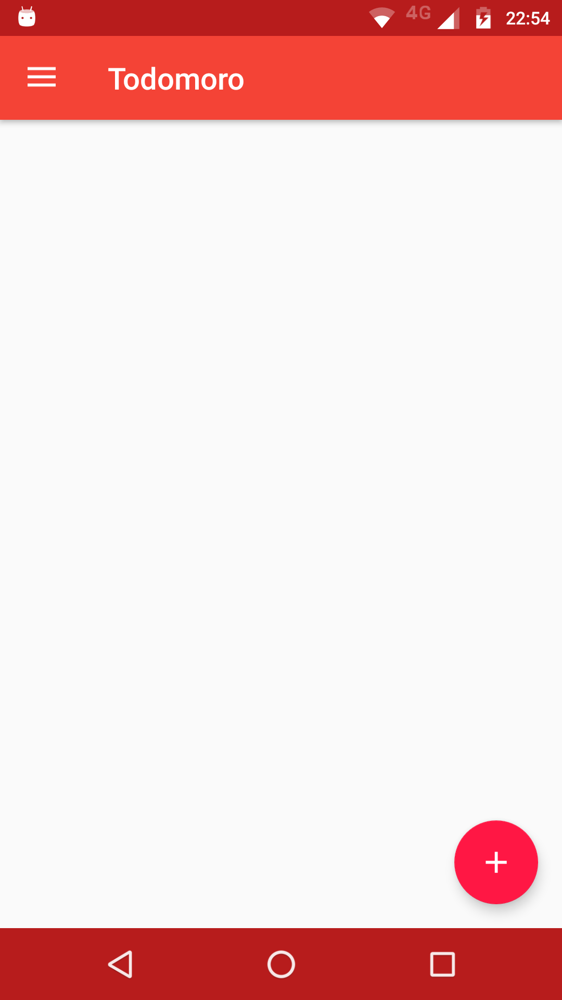
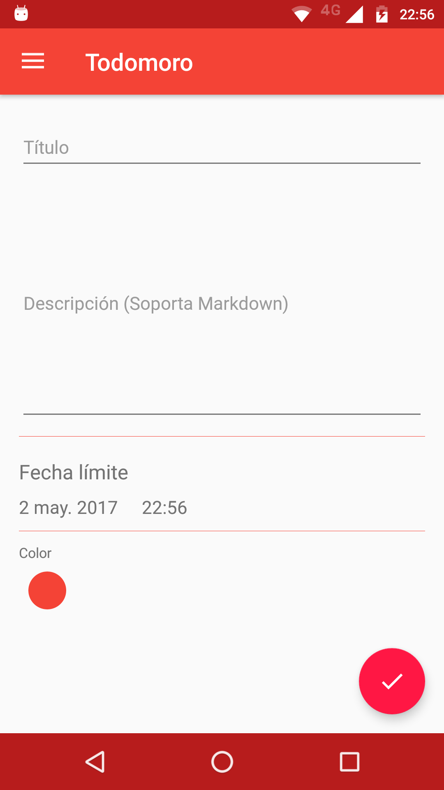
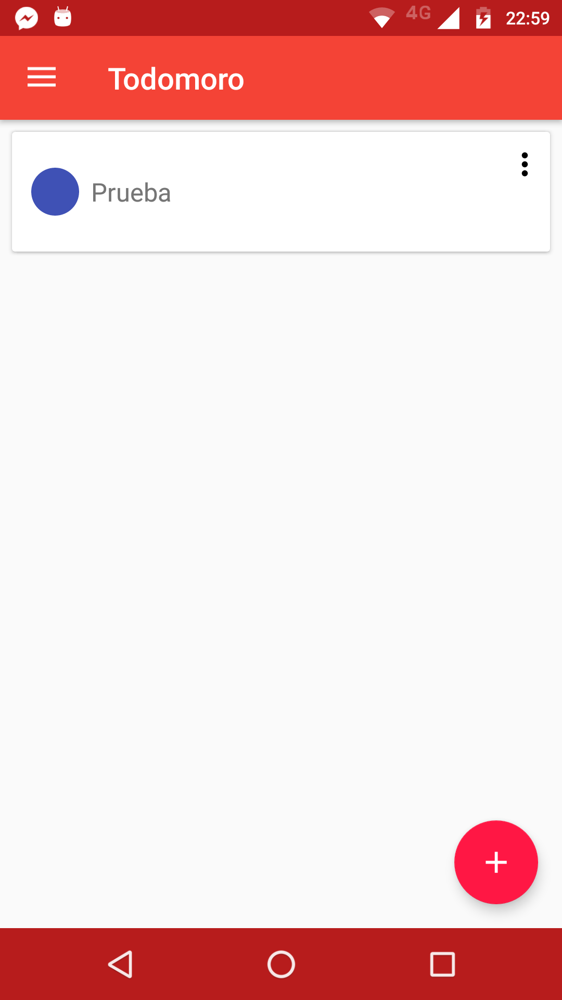
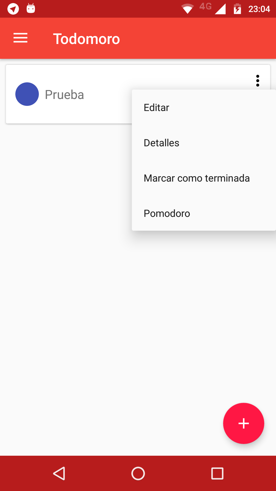
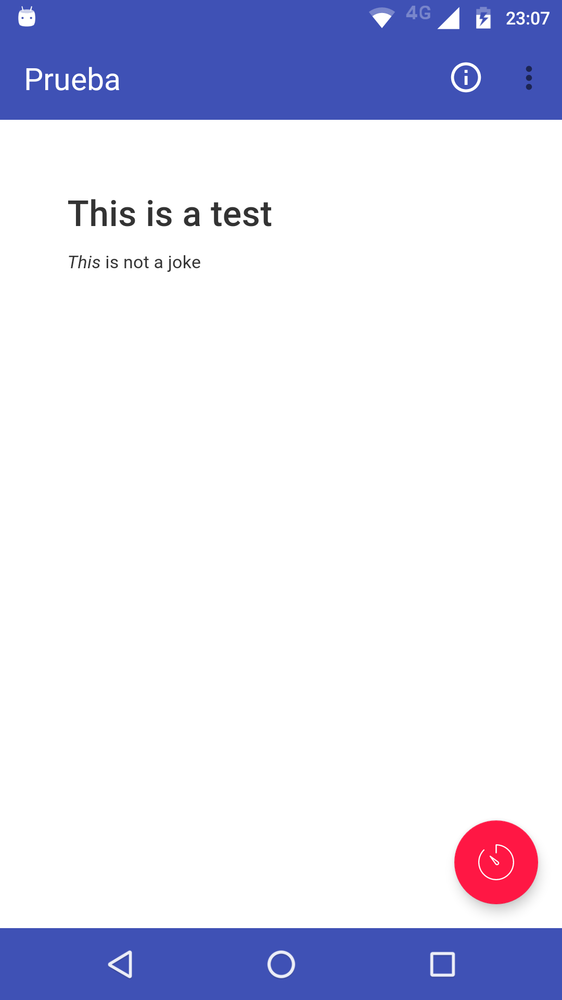
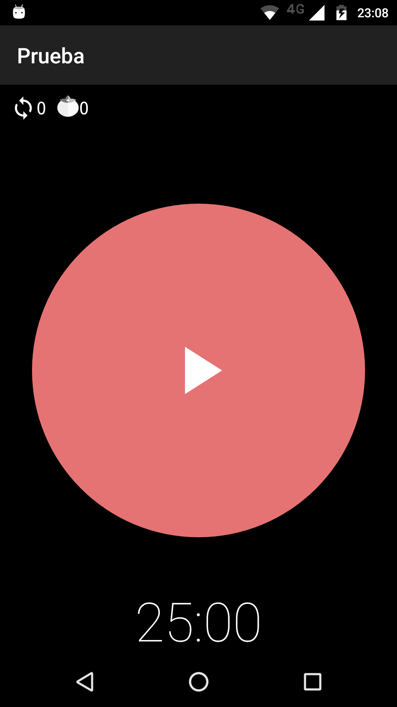

# Todomoro

## Primeros pasos

Primero habrá que instalar el APK, para posteriormente poder Iniciar Sesión o Registrarse, una vez hecho esto, llegarás a la pantalla inicial:

Esta es la pantalla inicial, aquí se mostrará una lista de las tareas que tengas pendientes, y puedes agregar más por medio del botón flotante.

### Agregando Tareas

Agregar tareas es sencillo, por lo regular sólo requiere un título, en la descripción puede ir cualquier contenido que desees (Markdown está soportado), la fecha límite es sólo para estadísticas, para saber con que tanto tiempo de anticipación terminaste tu pendiente, y el color es para que cada quién maneje prioridades de una manera más sencilla.

Una vez hecha la tarea, se mostrará de la siguiente manera:

Aquí hay varios eventos:

+ Tap sencillo: Muestra los detalles de la tarea
+ Tap prolongado: Muestra el menú contextual con la opción de **Eliminar** habilitado
+ Menú contextual: Aquí se despliegan varias opciones como
  + Editar - Edita el contenido, hora límite, inclusive el color
  + Detalles - Muestra el título de la tarea así como lo que hayas redactado en descripción
  + Marcar como terminada **IMPORTANTE: Manualmente debes marcar una tarea como concluida**
  + Pomodoro - Acceso directo al Pomodoro específico para esa tarea

### Detalles

En esta sección podrán ver lo que hayan redactado de Descripción, así como un botón para iniciar el Pomodoro, además de un menú contextual con información general. El botón de información que aparece aquí muestra dos cosas:

+ Creado - Cuando se dió de alta la tarea
+ Actualizado - Último registro de actualización (sólo de datos, no de avance en Pomodoro)

### Pomodoro

Aquí es la ventana principal de Pomodoro, el cual consta de varias secciones:

+ Indicadores superiores - En la parte principal tenemos dos indicadores, el primero marca cuantos *ciclos* se han completado, mientras que el segundo indica los pomodoros completados.
  + Un cíclo = 4 Pomodoros + 4 Breaks
  + 1 Pomodoro = 25 minutos

Después viene el indicador gigante, que es sólo visual para medir el tiempo restante, mientras que viene un botón de pausa/play y un indicador.

Al iniciar el Pomodoro, este comenzará el conteo, y al terminar el mismo, el teléfono vibrará para indicar la finalización, así como marcar el nuevo tiempo (ya sea el tiempo para el break o un break largo). El inicio del siguiente contador siempre es manual, para reforzar el hecho de que están haciendo su trabajo.